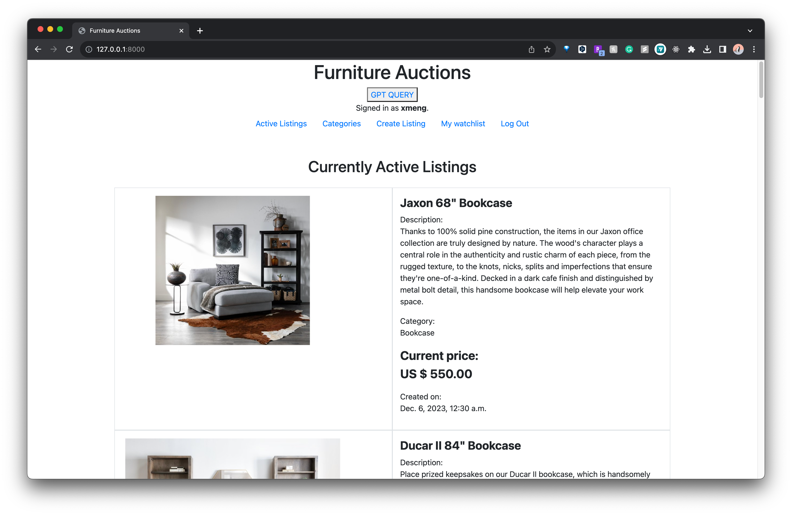
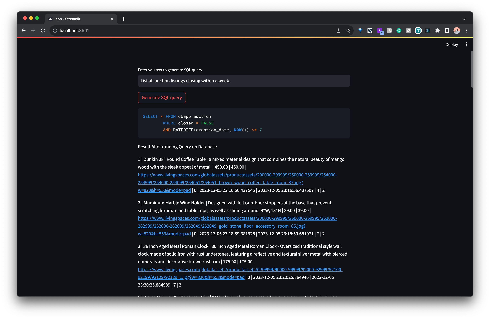

<div align="center">

# DBAuctionSystem — Furniture Auction Platform (Django + MySQL + Streamlit)

An RDBMS‑backed auction site for furniture, built with Django and MySQL. Includes a Streamlit mini‑app that translates natural‑language queries to SQL using OpenAI for exploratory data access.

</div>

## Overview

- Team: Team 9 — Siying Chen, Weihong Yang, Xiaoqing Meng, Junyi Liu
- Core: Django web app for listings, bidding, comments, watchlists; custom `User`
- DB: MySQL (local or Cloud SQL). SQL assets (DDL/DML/Views/Triggers) included
- NL→SQL: Streamlit app uses OpenAI to generate SQL from plain English

## Features

- Auth: register, login, logout; Django admin for data management
- Listings: create listing with title/description/category/image/starting bid
- Bidding: place bids, tracks current/highest bid, close auctions
- Comments: add comments per listing
- Watchlist: add/remove items; personal watchlist page
- Categories: browse by category
- Natural‑language SQL: Streamlit UI to query data in English and run generated SQL

## Tech Stack

- Python 3.9+ • Django 3.1.x
- MySQL 8.x • PyMySQL / mysqlclient
- Streamlit for NL→SQL demo
- Optional: Google Cloud SQL (App Engine/Cloud Run style connection)

## Repository Structure

```
DBAuctionSystem/
├─ dbauction/                      # Django project
│  ├─ manage.py
│  ├─ dbauction/                   # Django settings/urls/wsgi
│  ├─ dbapp/                       # App: models, views, forms, urls
│  ├─ templates/                   # Jinja2/HTML templates
│  ├─ static/                      # Static files (incl. admin assets)
│  ├─ requirements.txt             # Django dependencies
│  └─ StreamLitApp/                # Streamlit NL→SQL demo
│     ├─ app.py
│     └─ requirements.txt
├─ Group9_SQL_script/              # DDL, DML, Views, Triggers
└─ dbenv/ or auction/              # Local Python virtualenvs (optional)
```

## Prerequisites

- Python 3.9 or newer
- MySQL 8 (local or remote) and a database named `auction`
- pip/venv (recommended)

## Setup — Django App

1) Create and activate a virtualenv

```
python3 -m venv .venv
source .venv/bin/activate   # Windows: .venv\Scripts\activate
```

2) Install dependencies

```
pip install -r dbauction/requirements.txt
```

3) Configure database connection (local dev)

The project currently reads MySQL settings from `dbauction/dbauction/settings.py`.
- For local dev, set host/user/password/name to your MySQL instance
- For Cloud SQL (GAE), it switches based on `GAE_APPLICATION` env var

Recommended: use environment variables and a `local_settings.py` override to avoid committing secrets. Example variables to define:
- `DB_HOST`, `DB_NAME`, `DB_USER`, `DB_PASSWORD`, `DB_PORT`
- `DJANGO_SECRET_KEY`

4) Initialize database schema

Option A — via Django migrations:
```
cd dbAuction/
python manage.py migrate
python manage.py createsuperuser  # optional admin
```

Option B — via provided SQL assets:
- See `Group9_SQL_script/Phase4_submission/` (DDL, DML, Views, Triggers)
- Create the `auction` schema, run `dbDDL.sql`, then seed with `dbDML.sql`

5) Run the app

```
cd dbauction
python manage.py runserver
```

## Setup — Streamlit NL→SQL Demo

1) Install dependencies for Streamlit

```
pip install -r dbauction/StreamLitApp/requirements.txt
```

2) Configure environment

Choose either environment variables or Streamlit secrets.

- Environment variables (.env.exmaple)

- Streamlit secrets (recommended for Streamlit):
  - Create `./.streamlit/secrets.toml` with:
    - `OPENAI_API_KEY = "your_key"`
    - Top‑level keys for Streamlit app (optional):
      - `DB_HOST = "your_mysql_host"`
      - `DB_NAME = "auction"`
      - `DB_USER = "root"`
      - `DB_PASSWORD = "your_password"`
      - `DB_PORT = "3306"`
    - And/or a block for Django fallback:
      - `[mysql]`
      - `host = "your_mysql_host"`
      - `name = "auction"`
      - `user = "root"`
      - `port = "3306"`
      - `password = "your_password"`
    - Optionally, a Django section for secret key:
      - `[django]`
      - `secret_key = "your_django_secret"`

Notes:
- The repo `.gitignore` excludes `.streamlit/secrets.toml` and `.env*`.
- Production uses environment variables only; `.streamlit/secrets.toml` is intended for local development.
- Django reads DB settings from env first; if missing and `DJANGO_DEBUG=1`, it falls back to `[mysql]` in `./.streamlit/secrets.toml`. `SECRET_KEY` can be set via `DJANGO_SECRET_KEY` or `[django].secret_key` (dev only). If none and `DJANGO_DEBUG=1`, a temporary key is generated.
- The app will warn if the key or DB credentials are not configured.

## Deployment

- Set environment variables: `DJANGO_SECRET_KEY`, `DB_HOST`, `DB_NAME`, `DB_USER`, `DB_PASSWORD`, `DB_PORT`, `DJANGO_DEBUG=0`
- Configure `ALLOWED_HOSTS` in `settings.py` (or inject via env if you add it)
- Apply migrations: `python manage.py migrate`
- Collect static files: `python manage.py collectstatic --noinput`
- Run with a production server (gunicorn/uwsgi) behind a reverse proxy

3) Run Streamlit

```
cd dbauction/StreamLitApp
streamlit run app.py
```

Note: The current `app.py` uses a legacy OpenAI completion model and hard‑coded settings. For production/hardening, switch to environment variables and a modern model.

## URLs (Django)

- `/` — Home (open listings)
- `/login`, `/logout`, `/register`
- `/create` — New listing
- `/listing/<id>` — Listing detail (bid/comment/close)
- `/categories`, `/categories/<id>`
- `/watchlist`

## Screenshots

Screenshots are available in `dbauction/demo/`:

Home page

Streamlit NL→SQL



## Troubleshooting

- MySQL connection errors: verify host/port/user/password and DB exists
- Migrations failing: ensure MySQL 8 and correct permissions; try `python manage.py migrate --plan`
- Static files: run `python manage.py collectstatic` when deploying
- OpenAI errors: confirm `OPENAI_API_KEY` and model availability
- Installation error for `openAI`: use the pip package name `openai` if needed

## Security Notes

- Do not commit secrets (DB passwords, OpenAI keys, Django `SECRET_KEY`)
- Prefer environment variables or a non‑tracked `local_settings.py`

## Roadmap

- Move all secrets to environment variables (Django + Streamlit)
- Replace legacy OpenAI completion API with up‑to‑date models
- Add tests (unit/integration) for bidding and permissions
- Add pagination/search, richer user profiles, seller dashboards
- Containerize (Docker) and add CI for deploys

## License

license (MIT/Apache‑2.0, etc.).
